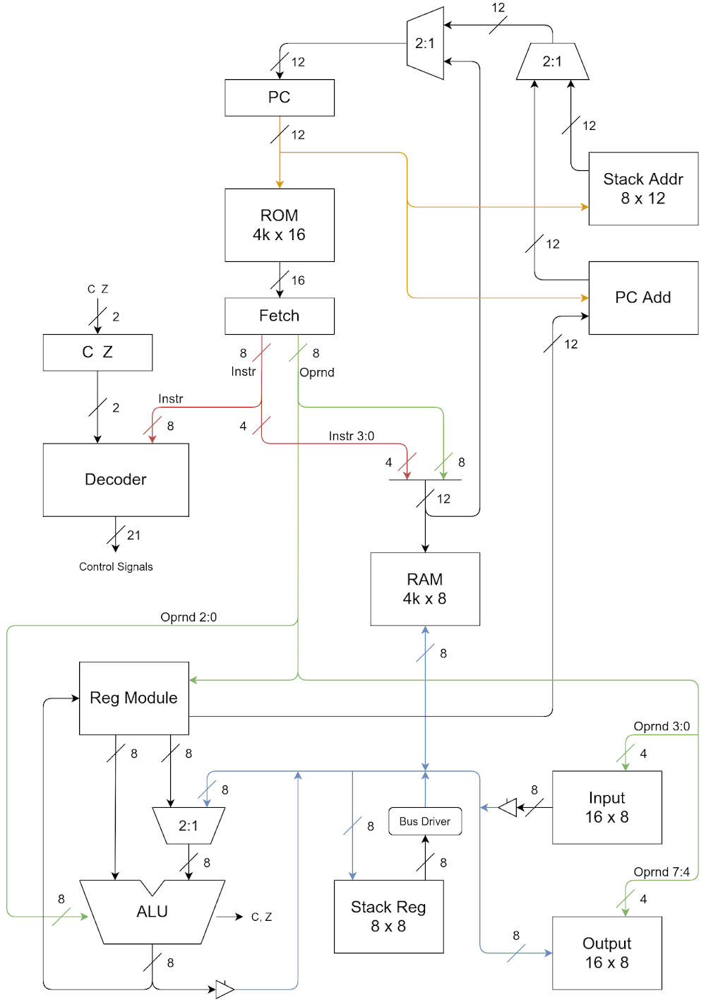
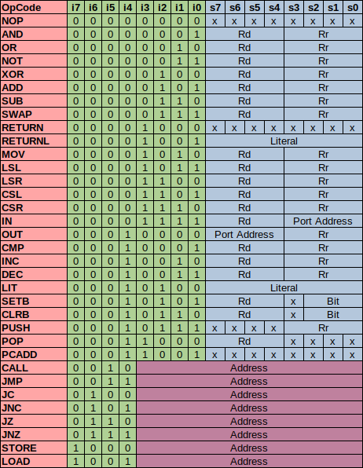

# byter
Custom 8-bit CPU inspired by modified [Nibbler](https://www.bigmessowires.com/nibbler/) arquitecture used in university course.

## Characteristics
- 12-bit program counter.
- 16-bit width instructions.
- 4096 byte, 16-bit width ROM.
- 4096 byte, 8-bit width RAM.
- 16 8-bit work registers.
- Call stack with depth of 8 addresses.
- Register stack with depth of 8 values.
- 16 8-bit input ports.
- 16 8-bit output ports.
- Carry and zero flag.
- Also assembler compiler and simple vm included.

## Instruction Set

- Literals are loaded to register R14.
- Value of RAM to read/write is through register R15.
- When adding to program counter, lower nibble of register R13 is concatenated with register R12 for full 12-bits of address (PC += {R13[3:0], R12}).

## Compiler
Simple compiler donde in (Haxe)[http://haxe.org/].
Support for:
- Comments
- Labels for function calls
- Variables
- Hexadecimal, decimal and binary values.

## VM
Simple vm in C for running compiled code, no interface with OS.

## TODO
- [ ] Redo compiler in C, with better asm syntax.
- [ ] GUI for easier viewing of registers, pc, stacks, ports, etc in VM.
- [ ] More detailed documentation.
- [ ] Test in real FPGA.
- [ ] Don't depend on apio for verilog?
- [ ] Redo block diagram image for better visualizatoin without needing to be huge.

